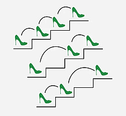

Ways to Reach the n'th Stair

Difficulty: Medium

There are n stairs, a person standing at the bottom wants to reach the top. The person can climb either 1 stair or 2 stairs at a time. Your task is to count the number of ways, the person can reach the top (order does matter).

Examples:

Input: n = 1
Output: 1
Explanation: There is only one way to climb 1 stair. 
Input: n = 3
Output: 3
Explanation: The following are three ways to reach the n-th stair.
 
Input: n = 4
Output: 5
Explanation: There are five ways to reach 4th stair: {1, 1, 1, 1}, {1, 1, 2}, {2, 1, 1}, {1, 2, 1} and {2, 2}.
Constraints:
1 ≤ n ≤ 40